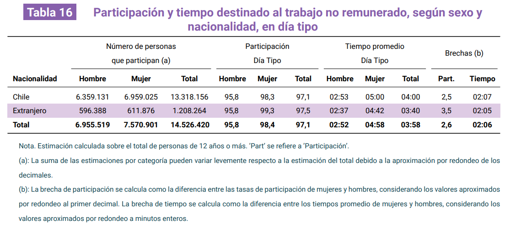

# Selección de artículo
El artículo seleccionado para el análisis de reproducibilidad es la segunda Encuesta Nacional sobre Uso de Tiempo (ENUT), publicada por el Instituto Nacional de Estadística en Chile. Esta encuesta permite conocer cómo las personas distribuyen su tiempo entre diferentes actividades, como trabajo, estudio, ocio, entre otras. 

El objetivo general de la encuesta es "obtener información de cómo las personas de 12 años o más utilizan su tiempo, principalmente en torno al trabajo no remunerado, trabajo en la ocupación y actividades personales; además de proveer información relacionada a su calidad de vida y bienestar respecto a su uso de tiempo en las principales zonas urbanas del país" [@ineficha2025].

Entre los objetivos específicos se encuentra: identificar brechas de género, medición de carga laboral a través del tiempo dedicado a la ocupación y trabajo no remunerado, medir uso de tiempo y satisfacción de la población, y por último, identificar acceso y necesidad de servicios e instituciones de cuidado para la población dependiente. 

Para el reporte de reproducibilidad, se escoge este artículo con el propósito de tener una base de datos amplia y detallada sobre el uso del tiempo en la población chilena, lo que nos permitirá realizar un análisis reproducible significativo y relevante. Además, la encuesta proporciona una gran cantidad de variables y resultados que pueden ser utilizados para explorar diferentes aspectos del uso del tiempo (como los presentados en los objetivos de la encuesta) lo que nos permitirá profundizar en el análisis y obtener insights valiosos sobre las actividades diarias de las personas.

En ese sentido, desde el informe de principales resultados de la encuesta, hemos escogido la tabla 16 que muestra la participación y tiempo destinado al trabajo no remunerado según sexo y nacionalidad. 


# Evaluación de reproducibilidad

  -   **Disponibilidad de datos**: 
  El artículo sí proporciona acceso a los datos utilizados en el estudio. Los datos están disponibles a través del sitio web del [Instituto Nacional de Estadística de Chile](https://www.ine.gob.cl/enut), donde se pueden descargar en variados formatos. No hubo dificultades para obtener los datos, ya que el acceso es público y se encuentra claramente indicado en la página web. Además, el artículo incluye un enlace directo a la sección de descarga de datos.   
  -   **Disponibilidad de código**: 
  No obstante, el artículo no proporciona acceso al código para el análisis. Sin embargo, en el [Manual de Uso de base de datos](#ref-inemanual2025) se describen las variables y se entrega de manera robusta el flujo de trabajo que se llevó a cabo para procesar correctamente los microdatos de la encuesta, lo que puede ser de gran ayuda para la replicabilidad. En ese sentido, se especifica la organización de la estructura de la base de datos; librerías necesarias para el procesamiento y la limpieza; metodología para la construcción de indicadores complejos a partir de las preguntas base del cuestionario y, por último, el diseño muestral complejo para asegurar resultados representativos. A pesar de esto, la falta de acceso al código específico utilizado en el estudio dificulta la replicación exacta del análisis realizado, por lo que se utilizarán códigos propios para el proceso de reproducción.  
  -   **Documentación**: 
    Existe una descripción clara de los métodos y procedimientos utilizados en el estudio, especialmente en el *Documento Metodológico*. En el *Capítulo 5*, el @inedocumento2025 detalla el diseño estadístico, brindando todas las informaciones necesarias tales como el marco y diseño muestral, la estrategias de muestreo aplicada, factores de expansión, y más. Asimismo, el *Capítulo 6* nos entrega la metodología de recolección de datos y el *Capítulo 7*, la metodología de procesamiento de datos. En conjunto, estos capítulos y el documento como tal, además del @ineinforme2026 en el cual se transparentan los errores no muestrales y las tasas de respuesta por región. Con todo esto, se puede afirmar que la documentación es suficiente para que otro investigador pueda replicar el estudio, aunque la falta de acceso al código específico utilizado en el análisis puede presentar un desafío adicional para la replicación exacta. 
  -   **Transparencia**: 
  En torno a la transparencia de la investigación, el Instituto Nacional de Estadística de Chile [-@ineinforme2025] identifica en sus primeras páginas todos los nombres y cargos de los responsables del proyecto. Asimismo, proporciona información sobre el financiamiento del estudio, indicando que fue financiado por el Instituto Nacional de Estadística de Chile. Por otra parte, la sección *2.1. Instrumentos de medición*, señala que se utiliza la plataforma *Survey Solutions* del Banco Central lo cual podría reforzar la transparencia en el manejo de los datos y de su recolección. Sin embargo, no se menciona explícitamente si existen o podrían existir conflictos de interés relacionados con el estudio. De todas formas, la primera versión de esta encuesta "permitió la implementación y mejora de políticas públicas en el país relativas principalmente a la promoción de la autonomía económica de las mujeres en el país" [@ineinforme2025], con lo que se puede interpretar que esta segunda versión también contribuirá a esos fines, lo que podría ser un indicio de que no existen conflictos de interés o la intención de beneficiar a ciertos grupos específicos, sino brindar datos para la búsqueda de una sociedad con igualdad de género. 


# Análisis reproducible

## Resultado a reproducir
Para el análisis reproducible se seleccionó la Tabla 16 del [Informe de Principales Resultados](#ref-ineinforme2025) de la ENUT, que muestra la participación y tiempo destinado al trabajo no remunerado, según sexo y nacionalidad en día tipo. 


## Proceso de reproducción
Para el procesamiento, limpieza y cálculos de variables, se utilizó el *Manual de Uso de Base de Datos*, que proporciona una descripción detallada de la estructura de la base de datos y las variables disponibles. En ese sentido, se identificaron las líneas de código necesarias que, a continuación, se presentan para el proceso de reproducción.

### Procesamiento
- Incluye el código utilizado para procesar los datos, junto con una explicación de cada paso. 

En primer lugar, se cargan las librerías necesarias para el procesamiento de los datos y se descarga la bases de datos (que se encuentra en input, data, original), para luego hacer la identificación de las variables de interés, que en este caso son las variables de participación y tiempo destinado al trabajo no remunerado, tanto para día tipo como para fin de semana. 

```{r}
#| label: limpieza de datos

# Cargar librerías necesarias
library(tidyverse)
library(haven)
library(survey)
library(gt)

# Cargar datos
ENUT_DATA <- readRDS("input/data/original/250403-ii-enut-bdd-r-v2.RDS")

# Selección de variables 
## Variables de participación 

ds_vars_part <- ENUT_DATA %>%
  select(matches("^tc\\d*_p_ds$"), matches("^td\\d*_p_ds$"),
         matches("^tv\\d*_p_ds$")) %>%
  names()

fds_vars_part <- ENUT_DATA %>%
  select(matches("^tc\\d*_p_fds$"), matches("^td\\d*_p_fds$"),
         matches("^tv\\d*_p_fds$")) %>%
  names()

ds_vars_tiempo <- ENUT_DATA %>%
  select(matches("^tc\\d*_t(_n[1-4])?_ds$"),
         matches("^td\\d*_t_ds$"),
         matches("^tv\\d*_t_ds$")) %>%
  names()

fds_vars_tiempo <- ENUT_DATA %>%
  select(matches("^tc\\d*_t(_n[1-4])?_fds$"),
         matches("^td\\d*_t_fds$"),
         matches("^tv\\d*_t_fds$")) %>%
  names()

```

 Se crea una base auxiliar que contiene únicamente la identificación de la persona, en base a si contestó o no el cuestionario, pero sin alterar la base original. 

 ```{r}
 #| label: base auxiliar

 enut_auxiliar <- ENUT_DATA %>%
  select(id_persona, tiempo,
         all_of(ds_vars_part), all_of(fds_vars_part),
         all_of(ds_vars_tiempo), all_of(fds_vars_tiempo))

enut_tnr <- ENUT_DATA %>% select(id_persona)

 ```

Posteriormente, se procede a derivar las variables de participación y tiempo. Por un lado, en participación, el código pretende escanear todas las actividades de trabajo no remunerado de cada persona, con el tratamiento de casos perdidos correspondiente en caso de no responder la pregunta, si el dato no existe o no aplica. Finalmente, se crea la participación de día tipo en base a si la persona participa en al menos una de las actividades de cuidado, domésticas, voluntarias o no. Por otro lado, en la variable de tiempo, se crean columnas temporales para que los datos perdidos no afecten las sumas de tiempo. Luego, se calcula el tiempo total destinado al trabajo no remunerado, ponderando el tiempo de día tipo por 5/7 y el tiempo de fin de semana por 2/7, para obtener una medida más representativa del tiempo semanal destinado a estas actividades.

```{r}
#| label: derivación variables

# Derivación de participación 

enut_auxiliar <- enut_auxiliar %>%
  mutate(
    p_tnr_ds =
      case_when(
        tiempo == 0
        ~ NA_real_,
        across(all_of(ds_vars_part), ~ . == 96) %>%
          rowSums(na.rm = TRUE) == length(ds_vars_part)
        ~ 96,
        rowSums(across(all_of(ds_vars_part), ~ . == 1),
                na.rm = TRUE) > 0
        ~ 1,
        rowSums(across(all_of(ds_vars_part), ~ . == 1),
                na.rm = TRUE) == 0
        ~ 0,
        TRUE ~ NA_real_),
    
    p_tnr_fds =
      case_when(
        tiempo == 0
        ~ NA_real_,
        across(all_of(fds_vars_part), ~ . == 96) %>%
          rowSums(na.rm = TRUE) == length(fds_vars_part)
        ~ 96,
        rowSums(across(all_of(fds_vars_part), ~ . == 1),
                na.rm = TRUE) > 0
        ~ 1,
        rowSums(across(all_of(fds_vars_part), ~ . == 1),
                na.rm = TRUE) == 0
        ~ 0,
        TRUE ~ NA_real_),
    
    p_tnr_dt =
      case_when(
        p_tnr_ds == 1 | p_tnr_fds == 1 ~ 1,
        p_tnr_ds == 96 | p_tnr_fds == 96 ~ 96,
        p_tnr_ds == 0 & p_tnr_fds == 0 ~ 0
      )
  )

rm(ds_vars_part, fds_vars_part)

# Derivación de tiempo

enut_auxiliar <- enut_auxiliar %>%
  mutate(
    across(
      all_of(ds_vars_tiempo),
      ~ replace(., . == 96 | . == 0, NA),
      .names = "temp_ds_{col}"),
    across(
      all_of(fds_vars_tiempo),
      ~ replace(., . == 96 | . == 0, NA),
      .names = "temp_fds_{col}"))

enut_auxiliar <- enut_auxiliar %>%
  mutate(
    t_tnr_ds = rowSums(across(starts_with("temp_ds_")), na.rm = TRUE),
    t_tnr_ds = if_else(t_tnr_ds == 0, NA_real_, t_tnr_ds),
    t_tnr_fds = rowSums(across(starts_with("temp_fds_")), na.rm = TRUE),
    t_tnr_fds = if_else(t_tnr_fds == 0, NA_real_, t_tnr_fds),
    t_tnr_dt =
      case_when(
        !is.na(t_tnr_ds) & !is.na(t_tnr_fds)
        ~ (t_tnr_ds * 5/7) + (t_tnr_fds * 2/7),
        !is.na(t_tnr_ds) & is.na(t_tnr_fds)
        ~ t_tnr_ds * 5/7,
        is.na(t_tnr_ds) & !is.na(t_tnr_fds)
        ~ t_tnr_fds * 2/7,
        TRUE ~ NA_real_
      )
  )

rm(ds_vars_tiempo, fds_vars_tiempo)

```

Se unen las variables participación/tiempo a la base general y se eliminan columnas para evitar duplicados. 

```{r}
enut_auxiliar <- enut_auxiliar %>%
  select(id_persona, matches("^[pt]_tnr_(ds|fds|dt)$"))

enut_tnr <- left_join(x = enut_tnr, y = enut_auxiliar,
                      by = "id_persona")
rm(enut_auxiliar)

ENUT_DATA <- ENUT_DATA %>% select(-matches("tnr_(ds|fds|dt)"))
ENUT_DATA <- ENUT_DATA %>% left_join(enut_tnr, by = "id_persona")
rm(enut_tnr)

```

El siguiente paso, es el diseño muestral complejo, para asegurar que los resultados sean representativos de la población. Para esto, se utiliza la función `svydesign` del paquete `survey`, especificando las variables de identificación de conglomerados, estratos y pesos muestrales correspondientes a la encuesta. 

```{r}
#| label: diseño muestral complejo

enut1 <- ENUT_DATA %>%
  filter(!is.na(fe_cut))

disenio <- survey::svydesign(data = enut1, strata = ~varstrat,
                             ids = ~varunit, weights = ~fe_cut)
```

 Se hizo una estimación poblacional de trabajo no remunerado, donde se calcula la participación y tiempo totales; participación y tiempo por sexo y, participación y tiempo por sexo y nacionalidad.

```{r}
#| label: estimaciones poblacionales

# Participación y tiempo totales 

part_tnr_pdn  <- survey::svyby(formula = ~p_tnr_dt,
                               by = ~sexo + pdn, design = disenio,
                               FUN = survey::svymean,
                               na.rm = TRUE, vartype = c("se", "cv"))

tiemp_tnr_pdn <- survey::svyby(formula = ~t_tnr_dt,
                               by = ~sexo + pdn, design = disenio,
                               FUN = survey::svymean,
                               na.rm = TRUE, vartype = c("se", "cv"))

n_part <- survey::svyby(formula = ~I(p_tnr_dt == 1),
                        by = ~sexo + pdn, design = disenio,
                        FUN = survey::svytotal, na.rm = TRUE)

part_total  <- survey::svyby(formula = ~p_tnr_dt,
                             by = ~pdn, design = disenio,
                             FUN = survey::svymean, na.rm = TRUE)
tiemp_total <- survey::svyby(formula = ~t_tnr_dt,
                             by = ~pdn, design = disenio,
                             FUN = survey::svymean, na.rm = TRUE)
n_nac       <- survey::svyby(formula = ~I(p_tnr_dt == 1),
                             by = ~pdn, design = disenio,
                             FUN = survey::svytotal, na.rm = TRUE)

part_sexo  <- survey::svyby(formula = ~p_tnr_dt,
                            by = ~sexo, design = disenio,
                            FUN = survey::svymean, na.rm = TRUE)
tiemp_sexo <- survey::svyby(formula = ~t_tnr_dt,
                            by = ~sexo, design = disenio,
                            FUN = survey::svymean, na.rm = TRUE)

part_gral  <- survey::svymean(~p_tnr_dt, design = disenio, na.rm = TRUE)
tiemp_gral <- survey::svymean(~t_tnr_dt, design = disenio, na.rm = TRUE)
n_gral_val <- coef(survey::svytotal(~I(p_tnr_dt == 1),
                                    design = disenio,
                                    na.rm = TRUE))["I(p_tnr_dt == 1)TRUE"]

print(part_tnr_pdn)
print(tiemp_tnr_pdn)

```


Los códigos utilizados anteriormente son los códigos modificados, pero basados en los códigos originales que se encuentran en el Manual de uso de la base de datos, por lo que se han adaptado para el proceso de reproducción pero sin alterar su esencia. Para ello, se han utilizado como asistentes los lenguajes de IA Claude opus 4.6 de Anthropic y Gemini pro, que han permitido adaptar el código original a un formato más legible y organizado, sin modificar la lógica ni los pasos del proceso de análisis. Asimismo, pudiendo desarrollar el código específico para la reproducción de la tabla 16 del Informe de Principales Resultados de la ENUT, que no se encuentra en el *Manual de Uso de la Base de Datos*, pero que se deriva a partir de los códigos originales. 

En ese sentido, los cambios realizados en el código original para el proceso de reproducción fueron necesarios, dado que, si bien el *Manual de Uso de la Base de Datos* funciona como diccionario y base metodológica para el procesamiento de los datos, la dificultad principal es que plantea  el qué hacer con los datos, pero no especifica el cómo ni los códigos exactos necesarios.

La principal dificultad es que los codigos del manual de uso de base de datos entregan una estructura determinada para el procesamiento, mas no el codigo especifico para tratar algunas variables, a su vez, el manual no provee una sola linea de codigo legible para el procesamiento de la base de datos, sino bloques pequeños que retratan acciones especificas para casos particulares, en otras palabras, la linea completa del codigo original es el resultado de la union de varios bloques que se encuentran por separado, por tanto, la busqueda y tratamiento de las variables de interés se torna compleja. En este caso, dado el tamaño y complejidad de la base de datos, se hizo difícil la selección de variables y su inclusión, por ejemplo, para la identificación de la variable tiempo, en el manual estaba incompleto, por tanto se hizo una búsqueda del nombre de la variable para tratarse como tal y se consultó a la IA, para desarrollar el código necesario para el tratamiento de esta variable en la respectiva reproducibilidad. A su vez, para la derivación de participación, el código no incluía la participación en días de semana completa, constituyendose como variable central de toda la tabla, por tanto, se hizo necesario desarrollar el código mediante la IA, dado que sin ella (variable), ninguna estimación posterior podria haberse ejecutado. Otra dificulad encontrada es que no existe código que retrate la unión de las variables de interes a la base principal, sin este paso, el diseño muetral complejo no hubiese tenido acceso a las variables derivadas, el manual solo hace la unión en bases temporales o paralelas. En último lugar, para reproducir la tabla especificamente, en las estimaciones poblacionales, solo se tuvo que reemplazar "región" que es la variable original que el manual utiliza para la estimación por región, por "pdn" que es la variable de nacionalidad, para hacer las estimaciones de participacion chilena versus extranjera. 


- Los datos originales deben ser llamados desde input/data/original, el código de procesamiento se debe incluir en este mismo archivo (reporte-repro.qmd).

### Reproducción

```{r}
# Construccion de la tabla 

fmt_hm <- function(h) {
  hh <- floor(h)
  mm <- round((h - hh) * 60)
  sprintf("%02d:%02d", hh, mm)
}

np     <- function(row) n_part[row, "I(p_tnr_dt == 1)TRUE"]
np_nac <- function(row) n_nac[row,  "I(p_tnr_dt == 1)TRUE"]

tabla16 <- data.frame(
  Nacionalidad = c("Chile", "Extranjero", "Total"),
  N_Hombre = format(round(c(np("1.1"), np("1.2"),
                            np("1.1") + np("1.2"))),
                    big.mark = "."),
  N_Mujer  = format(round(c(np("2.1"), np("2.2"),
                            np("2.1") + np("2.2"))),
                    big.mark = "."),
  N_Total  = format(round(c(np_nac("1"), np_nac("2"), n_gral_val)),
                    big.mark = "."),
  Part_Hombre = round(c(part_tnr_pdn["1.1", "p_tnr_dt"],
                        part_tnr_pdn["1.2", "p_tnr_dt"],
                        part_sexo["1",  "p_tnr_dt"]) * 100, 1),
  Part_Mujer  = round(c(part_tnr_pdn["2.1", "p_tnr_dt"],
                        part_tnr_pdn["2.2", "p_tnr_dt"],
                        part_sexo["2",  "p_tnr_dt"]) * 100, 1),
  Part_Total  = round(c(part_total[1, "p_tnr_dt"],
                        part_total[2, "p_tnr_dt"],
                        coef(part_gral)) * 100, 1),
  Tiemp_Hombre = fmt_hm(c(tiemp_tnr_pdn["1.1", "t_tnr_dt"],
                          tiemp_tnr_pdn["1.2", "t_tnr_dt"],
                          tiemp_sexo["1",  "t_tnr_dt"])),
  Tiemp_Mujer  = fmt_hm(c(tiemp_tnr_pdn["2.1", "t_tnr_dt"],
                          tiemp_tnr_pdn["2.2", "t_tnr_dt"],
                          tiemp_sexo["2",  "t_tnr_dt"])),
  Tiemp_Total  = fmt_hm(c(tiemp_total[1, "t_tnr_dt"],
                          tiemp_total[2, "t_tnr_dt"],
                          coef(tiemp_gral)))
)

tabla16$Brecha_Part <- round(c(
  part_tnr_pdn["2.1", "p_tnr_dt"] - part_tnr_pdn["1.1", "p_tnr_dt"],
  part_tnr_pdn["2.2", "p_tnr_dt"] - part_tnr_pdn["1.2", "p_tnr_dt"],
  part_sexo["2", "p_tnr_dt"]      - part_sexo["1", "p_tnr_dt"]
) * 100, 1)

tabla16$Brecha_Tiemp <- fmt_hm(c(
  tiemp_tnr_pdn["2.1", "t_tnr_dt"] - tiemp_tnr_pdn["1.1", "t_tnr_dt"],
  tiemp_tnr_pdn["2.2", "t_tnr_dt"] - tiemp_tnr_pdn["1.2", "t_tnr_dt"],
  tiemp_sexo["2", "t_tnr_dt"]      - tiemp_sexo["1", "t_tnr_dt"]
))

# Visualizacion de la tabla

tabla16 |>
  gt() |>
  cols_label(
    Nacionalidad = "Nacionalidad",
    N_Hombre = "Hombre", N_Mujer = "Mujer", N_Total = "Total",
    Part_Hombre = "Hombre", Part_Mujer = "Mujer", Part_Total = "Total",
    Tiemp_Hombre = "Hombre", Tiemp_Mujer = "Mujer", Tiemp_Total = "Total",
    Brecha_Part = "Part.", Brecha_Tiemp = "Tiempo"
  ) |>
  tab_spanner(label = "Número de personas que participan (a)",
              columns = c(N_Hombre, N_Mujer, N_Total)) |>
  tab_spanner(label = "Participación Día Tipo",
              columns = c(Part_Hombre, Part_Mujer, Part_Total)) |>
  tab_spanner(label = "Tiempo promedio Día Tipo",
              columns = c(Tiemp_Hombre, Tiemp_Mujer, Tiemp_Total)) |>
  tab_spanner(label = "Brechas (b)",
              columns = c(Brecha_Part, Brecha_Tiemp)) |>
  tab_header(
    title = md("**Tabla 16**"),
    subtitle = "Participación y tiempo destinado al trabajo no remunerado, según sexo y nacionalidad, en día tipo"
  ) |>
  tab_style(
    style = cell_text(weight = "bold"),
    locations = cells_body(rows = Nacionalidad == "Total")
  )

```

# Conclusiones

Basándose en el análisis realizado, escriban una conclusión sobre el nivel de reproducibilidad del artículo seleccionado.

# Recomendaciones

Recomendaciones para mejorar la reproducibilidad del artículo, si es necesario.

# Referencias

::: {#refs}
:::

# Apéndice

## Material suplementario

- Incluyan aquí detalles metodológicos adicionales, en caso de ser necesario

## Código

Este es el codigo original que se encuentra en el manual de uso de base de datos, pero como se menciona en el analisis, no es un codigo legible ni completo para el proceso de reproducción. Ademas, la línea completa es el resultado de la unión de varios bloques por lo que se hizo necesario adaptarlo y desarrollarlo. 

```{r}
# Codigos de manual de uso de base de datos paso a paso.


## PASO 2: Identificacion de variables participacion y tiempo ---- 


# variables de participación 
ds_vars_part <- enut %>%
  select(matches("^tc\\d*_p_ds$"), matches("^td\\d*_p_ds$"),
         matches("^tv\\d*_p_ds$")) %>%
  names()
 
fds_vars_part <- enut %>%
  select(matches("^tc\\d*_p_fds$"), matches("^td\\d*_p_fds$"),
         matches("^tv\\d*_p_fds$")) %>%
  names()

# variables de tiempo 

  select(matches("^tc\\d*_t(_n[1-4])?_ds$"), matches("^td\\d*_t_ds$"),
         matches("^tv\\d*_t_ds$")) %>%
  names()

  fds_vars_tiempo <- enut %>%
  select(matches("^tc\\d*_t(_n[1-4])?_fds$"), matches("^td\\d*_t_fds$"),
         matches("^tv\\d*_t_fds$")) %>%
  names()

## PASO 3: CREACION DE BASE AUXILIAR ---- 

enut_auxiliar <- enut %>%
  select(id_persona, tiempo, matches(match = ds_vars_part),
         matches(match = fds_vars_part))


## PASO 4: DERIVAR VARIABLE DE PARTICIPACION  ---- 

enut_auxiliar <-
  enut_auxiliar %>%
  mutate(
    p_tnr_ds =
      case_when(
        # Cuando no hay CUT, asigna NA
        tiempo == 0
        ~ NA_real_,
        # Si todos los valores son 96, asigna 96
        across(
          all_of(ds_vars_part),
          ~ . == 96) %>%
          rowSums(na.rm = TRUE) == length(ds_vars_part)
        ~ 96,
        # Si al filtrar todos los valores 1 y sumarlos...
        # ...el resultado es mayor a 0, asigna 1
        rowSums(
          across(
            all_of(ds_vars_part), ~ . == 1),
          na.rm = TRUE) > 0
        ~ 1,
        # Si al filtrar todos los valores 1 y sumarlos...
        # ...el resultado es igual a 0, asigna 0
        rowSums(
          across(
            all_of(ds_vars_part), ~ . == 1),
          na.rm = TRUE) == 0
        ~ 0,
        # En cualquier otro escenario, asigna NA
        TRUE
        ~ NA_real_))

enut_auxiliar <-
  enut_auxiliar %>%
  mutate(
    p_tnr_fds =
      case_when(
        # Cuando no hay CUT, asigna NA
        tiempo == 0
        ~ NA_real_,
        # Si todos los valores son 96, asigna 96
        across(
          all_of(fds_vars_part),
          ~ . == 96) %>%
          rowSums(na.rm = TRUE) == length(fds_vars_part)
        ~ 96,
        # Si al filtrar todos los valores 1 y sumarlos...
        # ...el resultado es mayor a 0, asigna 1
        rowSums(
          across(
            all_of(fds_vars_part), ~ . == 1),
          na.rm = TRUE) > 0
        ~ 1,
        # Si al filtrar todos los valores 1 y sumarlos...
        # ...el resultado es igual a 0, asigna 0
        rowSums(
          across(
            all_of(fds_vars_part), ~ . == 1),
          na.rm = TRUE) == 0
        ~ 0,
        # En cualquier otro escenario, asigna NA
        TRUE
        ~ NA_real_))

# PASO 5: DERIVACION DE VARIABLE TIEMPO ----

enut_auxiliar <-
  enut %>%
  select(id_persona,
         tiempo,
         matches(match=ds_vars_tiempo),
         matches(match=fds_vars_tiempo))
enut_auxiliar <-
  enut_auxiliar %>%
  mutate(
    across(
      # En todas las variables de ds_vars_tiempo...
      all_of(ds_vars_tiempo),
      # ... si la variable toma el valor 96 o 0, asigna NA
      ~ replace(., . == 96 | . == 0, NA),
      # Guarda esto en una columna con el mismo nombre...
      # ...pero agrega el prefijo "temp_ds"
      .names = "temp_ds_{col}"),
    across(
      # En todas las variables de fds_vars_tiempo...
      all_of(fds_vars_tiempo),
      # ...si la variable toma el valor 96 o 0, asigna NA
      ~ replace(., . == 96 | . == 0, NA),
      # Guarda esto en una columna con el mismo nombre...
      # ...pero agrega el prefijo "temp_fds"
      .names = "temp_fds_{col}"))

# CALCULO DE TIEMPO 
enut_auxiliar <- enut_auxiliar %>%
  mutate(t_tnr_ds = rowSums(across(starts_with("temp_ds_")),
                            na.rm = TRUE), t_tnr_ds = if_else(t_tnr_ds ==
                                                                0, NA_real_, t_tnr_ds), t_tnr_fds = rowSums(across(starts_with("temp_fds_")),
                                                                                                            na.rm = TRUE), t_tnr_fds = if_else(t_tnr_fds ==
                                                                                                                                                 0, NA_real_, t_tnr_fds))
enut_auxiliar <- enut_auxiliar %>%
  mutate(t_tnr_dt = if_else(!is.na(t_tnr_ds) & !is.na(t_tnr_fds),
                            (t_tnr_ds * 5/7) + (t_tnr_fds * 2/7), coalesce(t_tnr_ds *
                                                                             5/7, t_tnr_fds * 2/7)))
rm(ds_vars_tiempo, fds_vars_tiempo) # Limpiar ambiente global
enut_auxiliar <- enut_auxiliar %>%
  select(id_persona, matches(match = "^t\\_tnr\\_(ds|fds|dt)$"))
enut_tnr <- left_join(x = enut_tnr, y = enut_auxiliar,
                      by = "id_persona")
rm(enut_auxiliar)


# Paso 7: Diseño muestral complejo ---- 

enut1 <- enut %>%
  filter(tiempo == 1)

disenio <- survey::svydesign(data = enut1, strata = ~varstrat,
                             ids = ~varunit, weights = ~fe_cut)


# PASO 8: ESTIMACIONES POBLACIONALES  ---- 

# participacion y tiempo totales 

part_tnr <- survey::svyciprop(~p_tnr_dt, design = disenio,
                              na.rm = TRUE)
print(part_tnr)

tiemp_tnr <- survey::svymean(~t_tnr_dt, design = disenio,
                             na.rm = TRUE)
print(tiemp_tnr)


# participacion y tiempo totales por sexo 

part_tnr_sexo <- survey::svyby(formula = ~p_tnr_dt,
                               by = ~sexo, design = disenio, FUN = survey::svyciprop,
                               na.rm = TRUE, vartype = c("se", "cv"))
tiemp_tnr_sexo <- svyby(formula = ~t_tnr_dt, by = ~sexo,
                        design = disenio, FUN = survey::svymean, na.rm = TRUE,
                        vartype = c("se", "cv"))
print(tiemp_tnr_sexo)


# participacion por sexo y nacionalidad 

part_tnr_sexo_reg <- survey::svyby(formula = ~p_tnr_dt,
                                   by = ~sexo + region_ord, design = disenio, FUN = survey::svyciprop,
                                   na.rm = TRUE, vartype = c("se"))
print(part_tnr_sexo_reg)

 # se reemplaza region por nacionalidad 
tiemp_tnr_sexo_reg <- survey::svyby(formula = ~t_tnr_dt,
                                    by = ~sexo + region_ord, design = disenio, FUN = survey::svymean,
                                    vartype = c("se"), na.rm = TRUE)
print(tiemp_tnr_sexo_reg) 


 
```


Código utilizado para la reproducción de la tabla 16, adaptado y desarrollado a partir del código original del manual de uso de base de datos.

```{r}
library(tidyverse)
library(haven)
library(survey)
library(gt)


# PASO 2: Identificación de variables participación y tiempo ----

ds_vars_part <- ENUT_DATA %>%
  select(matches("^tc\\d*_p_ds$"), matches("^td\\d*_p_ds$"),
         matches("^tv\\d*_p_ds$")) %>%
  names()

fds_vars_part <- ENUT_DATA %>%
  select(matches("^tc\\d*_p_fds$"), matches("^td\\d*_p_fds$"),
         matches("^tv\\d*_p_fds$")) %>%
  names()

ds_vars_tiempo <- ENUT_DATA %>%
  select(matches("^tc\\d*_t(_n[1-4])?_ds$"),
         matches("^td\\d*_t_ds$"),
         matches("^tv\\d*_t_ds$")) %>%
  names()

fds_vars_tiempo <- ENUT_DATA %>%
  select(matches("^tc\\d*_t(_n[1-4])?_fds$"),
         matches("^td\\d*_t_fds$"),
         matches("^tv\\d*_t_fds$")) %>%
  names()


## PASO 3: Creación de base auxiliar ----

enut_auxiliar <- ENUT_DATA %>%
  select(id_persona, tiempo,
         all_of(ds_vars_part), all_of(fds_vars_part),
         all_of(ds_vars_tiempo), all_of(fds_vars_tiempo))

enut_tnr <- ENUT_DATA %>% select(id_persona)


## PASO 4: Derivar variable de participación ----

enut_auxiliar <- enut_auxiliar %>%
  mutate(
    p_tnr_ds =
      case_when(
        tiempo == 0
        ~ NA_real_,
        across(all_of(ds_vars_part), ~ . == 96) %>%
          rowSums(na.rm = TRUE) == length(ds_vars_part)
        ~ 96,
        rowSums(across(all_of(ds_vars_part), ~ . == 1),
                na.rm = TRUE) > 0
        ~ 1,
        rowSums(across(all_of(ds_vars_part), ~ . == 1),
                na.rm = TRUE) == 0
        ~ 0,
        TRUE ~ NA_real_),
    
    p_tnr_fds =
      case_when(
        tiempo == 0
        ~ NA_real_,
        across(all_of(fds_vars_part), ~ . == 96) %>%
          rowSums(na.rm = TRUE) == length(fds_vars_part)
        ~ 96,
        rowSums(across(all_of(fds_vars_part), ~ . == 1),
                na.rm = TRUE) > 0
        ~ 1,
        rowSums(across(all_of(fds_vars_part), ~ . == 1),
                na.rm = TRUE) == 0
        ~ 0,
        TRUE ~ NA_real_),
    
    p_tnr_dt =
      case_when(
        p_tnr_ds == 1 | p_tnr_fds == 1 ~ 1,
        p_tnr_ds == 96 | p_tnr_fds == 96 ~ 96,
        p_tnr_ds == 0 & p_tnr_fds == 0 ~ 0
      )
  )

rm(ds_vars_part, fds_vars_part)


# PASO 5: Derivación de variable tiempo ----

enut_auxiliar <- enut_auxiliar %>%
  mutate(
    across(
      all_of(ds_vars_tiempo),
      ~ replace(., . == 96 | . == 0, NA),
      .names = "temp_ds_{col}"),
    across(
      all_of(fds_vars_tiempo),
      ~ replace(., . == 96 | . == 0, NA),
      .names = "temp_fds_{col}"))

enut_auxiliar <- enut_auxiliar %>%
  mutate(
    t_tnr_ds = rowSums(across(starts_with("temp_ds_")), na.rm = TRUE),
    t_tnr_ds = if_else(t_tnr_ds == 0, NA_real_, t_tnr_ds),
    t_tnr_fds = rowSums(across(starts_with("temp_fds_")), na.rm = TRUE),
    t_tnr_fds = if_else(t_tnr_fds == 0, NA_real_, t_tnr_fds),
    t_tnr_dt =
      case_when(
        !is.na(t_tnr_ds) & !is.na(t_tnr_fds)
        ~ (t_tnr_ds * 5/7) + (t_tnr_fds * 2/7),
        !is.na(t_tnr_ds) & is.na(t_tnr_fds)
        ~ t_tnr_ds * 5/7,
        is.na(t_tnr_ds) & !is.na(t_tnr_fds)
        ~ t_tnr_fds * 2/7,
        TRUE ~ NA_real_
      )
  )

rm(ds_vars_tiempo, fds_vars_tiempo)


# PASO 6: Unir variables generadas a la base principal ----

enut_auxiliar <- enut_auxiliar %>%
  select(id_persona, matches("^[pt]_tnr_(ds|fds|dt)$"))

enut_tnr <- left_join(x = enut_tnr, y = enut_auxiliar,
                      by = "id_persona")
rm(enut_auxiliar)

# Eliminar columnas tnr previas si existen (evita duplicados al re-ejecutar)
ENUT_DATA <- ENUT_DATA %>% select(-matches("tnr_(ds|fds|dt)"))
ENUT_DATA <- ENUT_DATA %>% left_join(enut_tnr, by = "id_persona")
rm(enut_tnr)


# PASO 7: Diseño muestral complejo ----

enut1 <- ENUT_DATA %>%
  filter(!is.na(fe_cut))

disenio <- survey::svydesign(data = enut1, strata = ~varstrat,
                             ids = ~varunit, weights = ~fe_cut)


# PASO 8: Estimaciones poblacionales ----

part_tnr_pdn  <- survey::svyby(formula = ~p_tnr_dt,
                               by = ~sexo + pdn, design = disenio,
                               FUN = survey::svymean,
                               na.rm = TRUE, vartype = c("se", "cv"))

tiemp_tnr_pdn <- survey::svyby(formula = ~t_tnr_dt,
                               by = ~sexo + pdn, design = disenio,
                               FUN = survey::svymean,
                               na.rm = TRUE, vartype = c("se", "cv"))

n_part <- survey::svyby(formula = ~I(p_tnr_dt == 1),
                        by = ~sexo + pdn, design = disenio,
                        FUN = survey::svytotal, na.rm = TRUE)

part_total  <- survey::svyby(formula = ~p_tnr_dt,
                             by = ~pdn, design = disenio,
                             FUN = survey::svymean, na.rm = TRUE)
tiemp_total <- survey::svyby(formula = ~t_tnr_dt,
                             by = ~pdn, design = disenio,
                             FUN = survey::svymean, na.rm = TRUE)
n_nac       <- survey::svyby(formula = ~I(p_tnr_dt == 1),
                             by = ~pdn, design = disenio,
                             FUN = survey::svytotal, na.rm = TRUE)

part_sexo  <- survey::svyby(formula = ~p_tnr_dt,
                            by = ~sexo, design = disenio,
                            FUN = survey::svymean, na.rm = TRUE)
tiemp_sexo <- survey::svyby(formula = ~t_tnr_dt,
                            by = ~sexo, design = disenio,
                            FUN = survey::svymean, na.rm = TRUE)

part_gral  <- survey::svymean(~p_tnr_dt, design = disenio, na.rm = TRUE)
tiemp_gral <- survey::svymean(~t_tnr_dt, design = disenio, na.rm = TRUE)
n_gral_val <- coef(survey::svytotal(~I(p_tnr_dt == 1),
                                    design = disenio,
                                    na.rm = TRUE))["I(p_tnr_dt == 1)TRUE"]

print(part_tnr_pdn)
print(tiemp_tnr_pdn)


# PASO 9: Construcción Tabla 16 ----

fmt_hm <- function(h) {
  hh <- floor(h)
  mm <- round((h - hh) * 60)
  sprintf("%02d:%02d", hh, mm)
}

np     <- function(row) n_part[row, "I(p_tnr_dt == 1)TRUE"]
np_nac <- function(row) n_nac[row,  "I(p_tnr_dt == 1)TRUE"]

tabla16 <- data.frame(
  Nacionalidad = c("Chile", "Extranjero", "Total"),
  N_Hombre = format(round(c(np("1.1"), np("1.2"),
                            np("1.1") + np("1.2"))),
                    big.mark = "."),
  N_Mujer  = format(round(c(np("2.1"), np("2.2"),
                            np("2.1") + np("2.2"))),
                    big.mark = "."),
  N_Total  = format(round(c(np_nac("1"), np_nac("2"), n_gral_val)),
                    big.mark = "."),
  Part_Hombre = round(c(part_tnr_pdn["1.1", "p_tnr_dt"],
                        part_tnr_pdn["1.2", "p_tnr_dt"],
                        part_sexo["1",  "p_tnr_dt"]) * 100, 1),
  Part_Mujer  = round(c(part_tnr_pdn["2.1", "p_tnr_dt"],
                        part_tnr_pdn["2.2", "p_tnr_dt"],
                        part_sexo["2",  "p_tnr_dt"]) * 100, 1),
  Part_Total  = round(c(part_total[1, "p_tnr_dt"],
                        part_total[2, "p_tnr_dt"],
                        coef(part_gral)) * 100, 1),
  Tiemp_Hombre = fmt_hm(c(tiemp_tnr_pdn["1.1", "t_tnr_dt"],
                          tiemp_tnr_pdn["1.2", "t_tnr_dt"],
                          tiemp_sexo["1",  "t_tnr_dt"])),
  Tiemp_Mujer  = fmt_hm(c(tiemp_tnr_pdn["2.1", "t_tnr_dt"],
                          tiemp_tnr_pdn["2.2", "t_tnr_dt"],
                          tiemp_sexo["2",  "t_tnr_dt"])),
  Tiemp_Total  = fmt_hm(c(tiemp_total[1, "t_tnr_dt"],
                          tiemp_total[2, "t_tnr_dt"],
                          coef(tiemp_gral)))
)

tabla16$Brecha_Part <- round(c(
  part_tnr_pdn["2.1", "p_tnr_dt"] - part_tnr_pdn["1.1", "p_tnr_dt"],
  part_tnr_pdn["2.2", "p_tnr_dt"] - part_tnr_pdn["1.2", "p_tnr_dt"],
  part_sexo["2", "p_tnr_dt"]      - part_sexo["1", "p_tnr_dt"]
) * 100, 1)

tabla16$Brecha_Tiemp <- fmt_hm(c(
  tiemp_tnr_pdn["2.1", "t_tnr_dt"] - tiemp_tnr_pdn["1.1", "t_tnr_dt"],
  tiemp_tnr_pdn["2.2", "t_tnr_dt"] - tiemp_tnr_pdn["1.2", "t_tnr_dt"],
  tiemp_sexo["2", "t_tnr_dt"]      - tiemp_sexo["1", "t_tnr_dt"]
))


# PASO 10: Visualización de la tabla ----

tabla16 |>
  gt() |>
  cols_label(
    Nacionalidad = "Nacionalidad",
    N_Hombre = "Hombre", N_Mujer = "Mujer", N_Total = "Total",
    Part_Hombre = "Hombre", Part_Mujer = "Mujer", Part_Total = "Total",
    Tiemp_Hombre = "Hombre", Tiemp_Mujer = "Mujer", Tiemp_Total = "Total",
    Brecha_Part = "Part.", Brecha_Tiemp = "Tiempo"
  ) |>
  tab_spanner(label = "Número de personas que participan (a)",
              columns = c(N_Hombre, N_Mujer, N_Total)) |>
  tab_spanner(label = "Participación Día Tipo",
              columns = c(Part_Hombre, Part_Mujer, Part_Total)) |>
  tab_spanner(label = "Tiempo promedio Día Tipo",
              columns = c(Tiemp_Hombre, Tiemp_Mujer, Tiemp_Total)) |>
  tab_spanner(label = "Brechas (b)",
              columns = c(Brecha_Part, Brecha_Tiemp)) |>
  tab_header(
    title = md("**Tabla 16**"),
    subtitle = "Participación y tiempo destinado al trabajo no remunerado, según sexo y nacionalidad, en día tipo"
  ) |>
  tab_style(
    style = cell_text(weight = "bold"),
    locations = cells_body(rows = Nacionalidad == "Total")
  )


```


